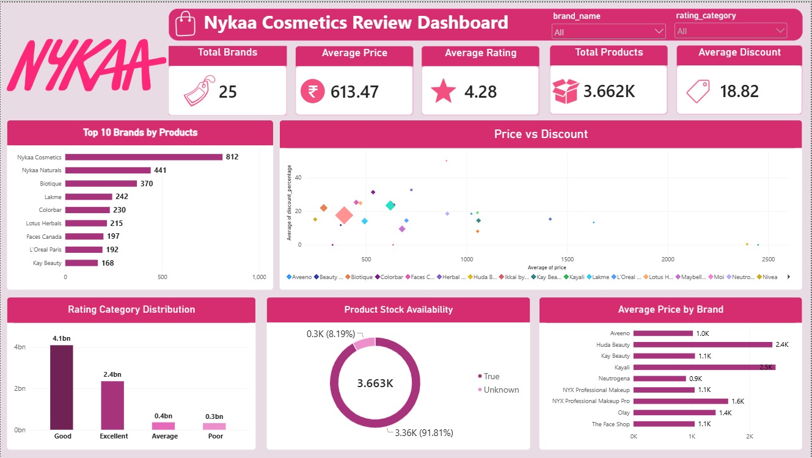

# Nykaa Cosmetics Reviews Analysis

This project is based on Nykaa cosmetics product data. I used the data to look at customer reviews, ratings, prices and different brands.

## About the Project

I started by exploring the dataset in Python and checking what kind of information was available. I used Pandas for cleaning and analysing the data.

After working with the data, I created different visualizations in Power BI to make the results easier to understand. I mainly looked at things like product ratings, number of reviews, prices and brand-wise comparisons.

## Tools I Used

- Python
- Pandas
- Jupyter Notebook
- Power BI

## What I Did

- Checked and explored the dataset
- Cleaned the data using Python and Pandas
- Looked at product ratings and reviews
- Compared different cosmetic brands
- Analysed product prices
- Created charts and visualizations
- Made a Power BI dashboard

## Project Files

- `NYKAA (1).ipynb` – Python work and analysis
- `nyka_top_brands_cosmetics_product_reviews.csv` – Dataset
- `nykaa.pbix` – Power BI dashboard

## What I Learned

While working on this project, I got more comfortable with Pandas and data cleaning. I also learned that just making charts is not enough. It is important to first understand the data and then decide what should actually be shown.

Working on the dashboard also gave me more practice in choosing suitable charts and presenting the information in a simple way.

## If I Continue This Project

I would like to explore the review text in more detail and see whether customer opinions are related to ratings. I would also like to compare more brands and look at price and rating patterns.

## Dashboard

### Power BI Dashboard

